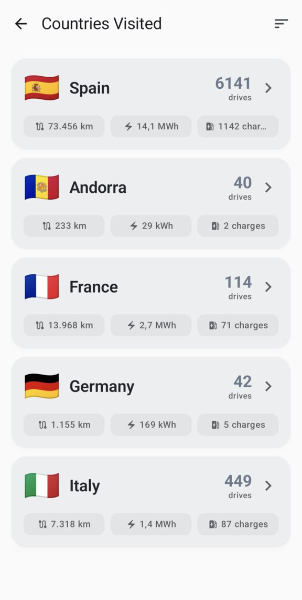

# MateDroid

<p>
<a href="https://f-droid.org/packages/com.matedroid/"></a>
<a href="https://buymeacoffee.com/vide"></a>
</p>
<br clear="all">

A native Android application for viewing Tesla vehicle data from your self-hosted [Teslamate](https://github.com/adriankumpf/teslamate) instance via the [TeslamateApi](https://github.com/tobiasehlert/teslamateapi).

**DISCLAIMER**: This app has been *vibe-coded*

## Features

- **Dashboard** - Real-time vehicle status at a glance with 3D car image matching your vehicle's color and wheels. Long tap it to change the picture.
- **Notifications** - Live notification (Android 16+) of charging sessions and pressure alert notification
- **Stats for Nerds** - Tap car image for advanced statistics: records, extremes, AC/DC ratio and much more!
- **Charging History** - View all charging sessions with statistics and charts
- **Charge Details** - Interactive map and detailed power/voltage/temperature charts
- **Drive History** - Track trips with efficiency metrics and route visualization
- **Battery Health** - Monitor battery degradation over time
- **Software Updates** - Track update history
- **Visited countries stats** - Show your friends all the places you visited with your car!
- **Car color based themes** - Light/dark themes with palette based on the car color
- **Multi-language** - Available in English, Italian, Spanish, and Catalan

### Gallery

<p>


</p>
<p>


</p>
<p>


</p>

### Feature Guide

#### Dashboard

Your car at a glance: live status, battery level, location on a map, tire pressures, and quick access to all the other sections. The 3D car image matches your actual color, trim, and wheels — tap it for stats, long-press to change the angle. When charging, the battery card comes alive with real-time power and ETA.

#### Charges & Drives

Both screens follow the same pattern: pick a time range, get a summary, swipe through interactive charts, and scroll the full history. Charges can be filtered by AC/DC and track cost. Drives can be filtered by distance category (commute, day trip, road trip) and show efficiency metrics. Tap any chart bar for its exact value.

#### Mileage

Yearly distance overview that you can drill down into: year → month → day → individual drives. Each level shows its own chart and stats. Great for spotting trends or remembering that one road trip.

#### Stats for Nerds

All your personal records in one place — longest drive, top speed, most efficient trip, longest streak, busiest day. Plus aggregated overviews of drives, charges, AC/DC ratio, and temperature stats. Filter by year or go all-time.

#### Battery Health

How your battery is holding up: current vs. original capacity, degradation percentage, range loss, and a degradation chart over time.

#### Software Updates

Update history with installation dates, time between updates, and a chart of update frequency. The version that ran the longest gets a badge.

#### Visited Countries

Every country you've driven through, with flags, distance, energy, and charge count. Sort however you like and tap a country to see its regions.

#### Theming & Notifications

The app themes itself based on your car's exterior color — every Tesla color has its own palette, in both light and dark mode. On Android 16+, you also get live charging notifications with real-time progress and tire pressure alerts in the background.

## Requirements

- Android 10 (API 29) or higher
- A running [Teslamate](https://github.com/adriankumpf/teslamate) instance
- [TeslamateApi](https://github.com/tobiasehlert/teslamateapi) deployed and accessible

**This projects needs Teslamate API to work**, it will not work just with plan Teslamate. Please follow the Teslamate API instructions and make sure it is working as expected before opening any issue, thanks!

## Installation

### From Release (Recommended)

Download the latest APK from the [Releases](https://github.com/vide/matedroid/releases) page and install it on your Android device.

### Build from Source

#### Prerequisites

- Java 17 or higher
- Android SDK (API 35)
- (Optional) Android Studio

#### Build Steps

```bash
# Clone the repository
git clone https://github.com/vide/matedroid.git
cd matedroid

# Build debug APK
./gradlew assembleDebug

# The APK will be at: app/build/outputs/apk/debug/app-debug.apk

# Or install directly to a connected device/emulator
./gradlew installDebug
```

## Development

Please see [DEVELOPMENT.md](docs/DEVELOPMENT.md) for more details on how this app was created and how to build and test it.

## License

This project is licensed under the GNU General Public License v3.0. See [LICENSE](LICENSE) for details.

## Acknowledgments

- [Teslamate](https://github.com/adriankumpf/teslamate) - Self-hosted Tesla data logger
- [TeslamateApi](https://github.com/tobiasehlert/teslamateapi) - RESTful API for Teslamate
- [t-buddy](https://github.com/garanda21/t-buddy) - iOS app that triggered this development and was used as inspiration. Many kudos, it's a wonderful app and you should use it if you are on iOS!
