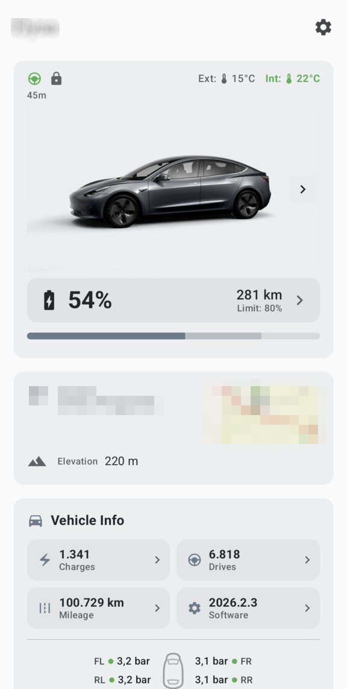
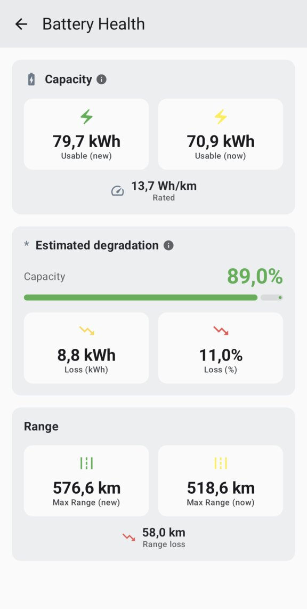
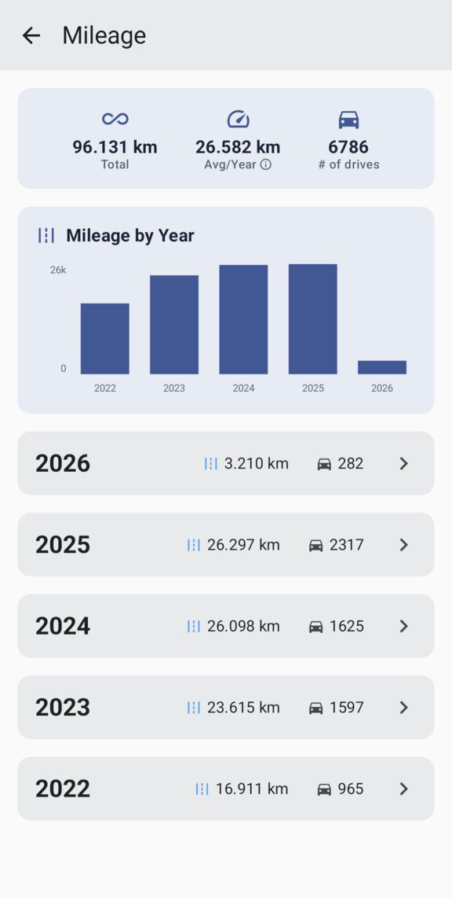
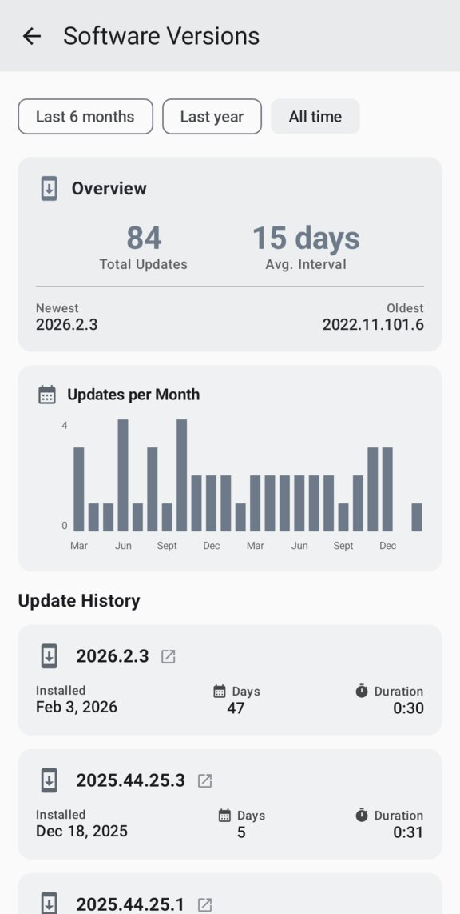
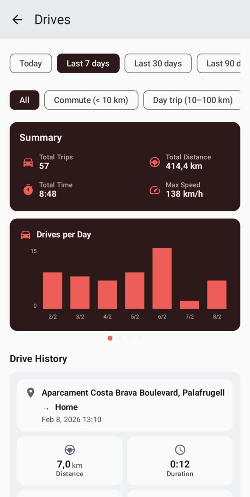
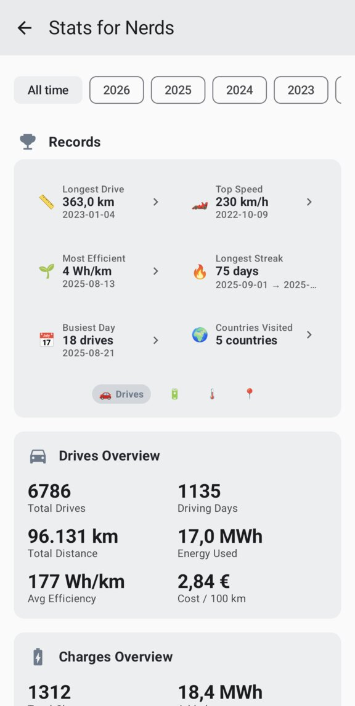

# MateDroid

A native Android application for viewing Tesla vehicle data from your self-hosted [Teslamate](https://github.com/adriankumpf/teslamate) instance via the [TeslamateApi](https://github.com/tobiasehlert/teslamateapi).

**DISCLAIMER**: This app has been *vibe-coded*

## Features

- **Dashboard** - Real-time vehicle status at a glance with 3D car image matching your vehicle's color and wheels
- **Stats for Nerds** - Tap car image for advanced statistics: records, extremes, AC/DC ratio and much more!
- **Charging History** - View all charging sessions with statistics and charts
- **Charge Details** - Interactive map and detailed power/voltage/temperature charts
- **Drive History** - Track trips with efficiency metrics and route visualization
- **Battery Health** - Monitor battery degradation over time
- **Software Updates** - Track update history
- **Car color based themes** - Light/dark themes with palette based on the car color

### Gallery

<p>




</p>
<p>




</p>

## Requirements

- Android 8.0 (API 26) or higher
- A running [Teslamate](https://github.com/adriankumpf/teslamate) instance
- [TeslamateApi](https://github.com/tobiasehlert/teslamateapi) deployed and accessible

**This projects needs Teslamate API to work**, it will not work just with plan Teslamate. Please follow the Teslamate API instructions and make sure it is working as expected before opening any issue, thanks!

## Installation

### From Release (Recommended)

Download the latest APK from the [Releases](https://github.com/vide/matedroid/releases) page and install it on your Android device.

### Build from Source

#### Prerequisites

- Java 17 or higher
- Android SDK (API 35)
- (Optional) Android Studio

#### Build Steps

```bash
# Clone the repository
git clone https://github.com/vide/matedroid.git
cd matedroid

# Build debug APK
./gradlew assembleDebug

# The APK will be at: app/build/outputs/apk/debug/app-debug.apk

# Or install directly to a connected device/emulator
./gradlew installDebug
```

## Development

Please see [DEVELOPMENT.md](docs/DEVELOPMENT.md) for more details on how this app was created and how to build and test it.

## License

This project is licensed under the GNU General Public License v3.0. See [LICENSE](LICENSE) for details.

## Acknowledgments

- [Teslamate](https://github.com/adriankumpf/teslamate) - Self-hosted Tesla data logger
- [TeslamateApi](https://github.com/tobiasehlert/teslamateapi) - RESTful API for Teslamate
- [t-buddy](https://github.com/garanda21/t-buddy) - iOS app that triggered this development and was used as inspiration. Many kudos, it's a wonderful app and you should use it if you are on iOS!
